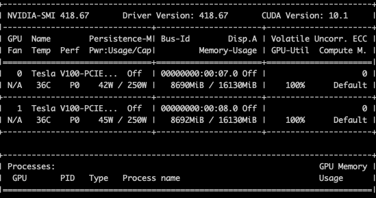
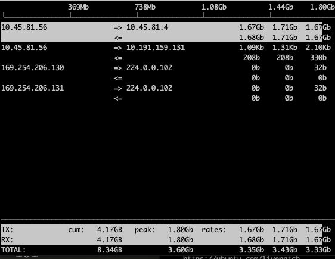
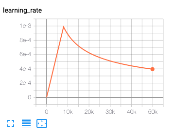
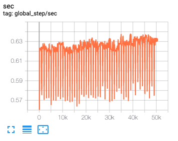

How long does it take to complete the training run? (hint: this session is on distributed training, so it will take a while)
```
On the v100, it took 22 hours, 22 minutes for 50k steps. I stopped at 50k because I was about to run out of IBM cloud credits. iF I think about 300k steps at the same rate, it would take ~134 hours.
```

Do you think your model is fully trained? How can you tell?
```
My model is not fully trained, because I limited the amount of steps it could take.
```
Were you overfitting?
```
No, both training loss and eval loss are about the same.
```

Were your GPUs fully utilized?



```
Yes, as we can see above.
```

Did you monitor network traffic (hint: apt install nmon ) ? Was network the bottleneck?



```
Network was NOT the bottleneck.
```


Take a look at the plot of the learning rate and then check the config file. Can you explan this setting?


```
  "lr_policy": transformer_policy,
  "lr_policy_params": {
    "learning_rate": 2.0,
    "warmup_steps": 8000,
    "d_model": d_model,
  },
```

How big was your training set (mb)? How many training lines did it contain?

```
I checked the size of train.clean.de. It was 695371444 bytes, or 695 MB.
```

What are the files that a TF checkpoint is comprised of?


How big is your resulting model checkpoint (mb)?

```
I checked the size of model.ckpt-0.data-00000-of-00001. It was 730570768 bytes, or 730 MB.
```

Remember the definition of a "step". How long did an average step take?



```
Any average steps per second is 0.6. Thus, each step takes 1/0.6 = 1.67 seconds.
```
How does that correlate with the observed network utilization between nodes?

```
Network utilization was constant between the nodes. The graph of it can be seen above.
```
